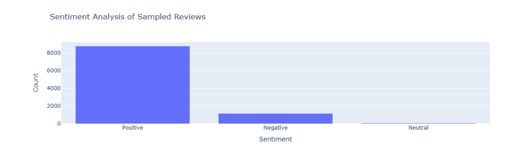
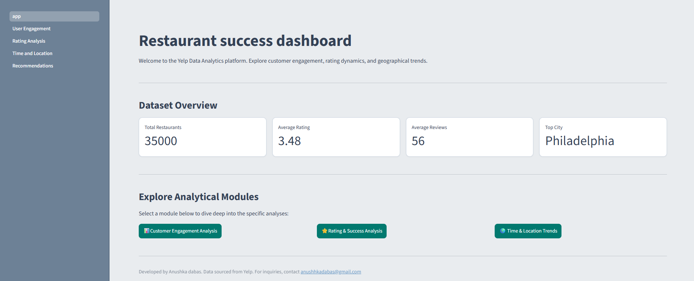
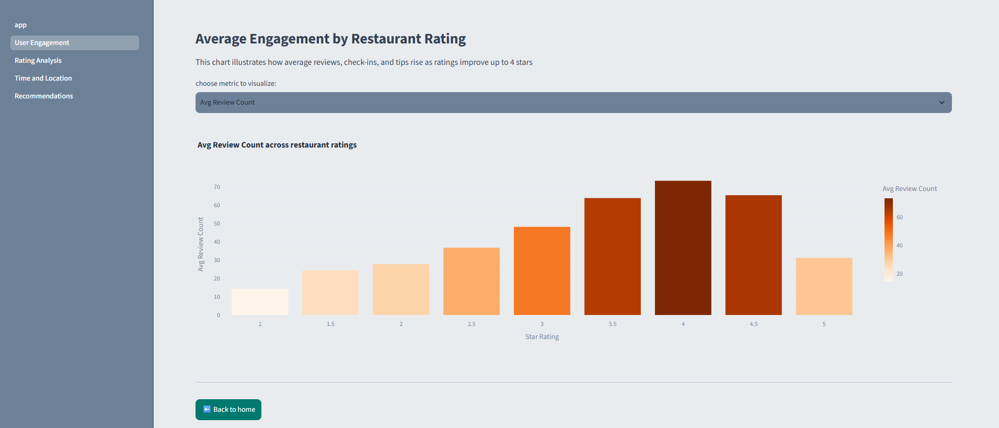
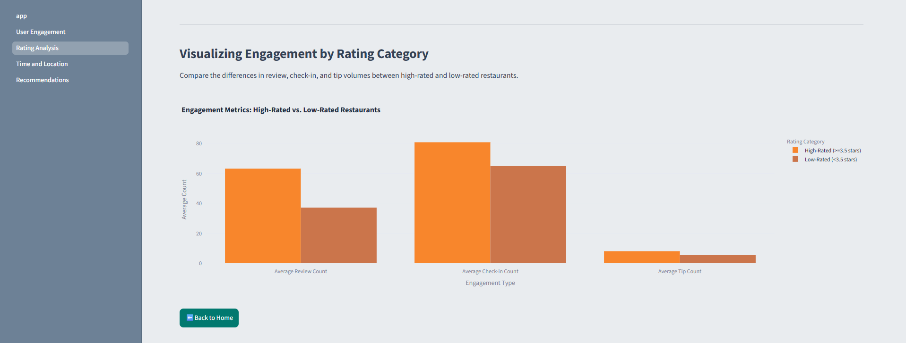
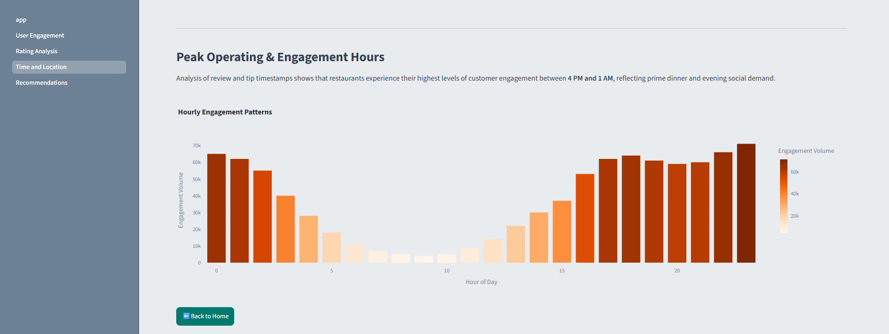
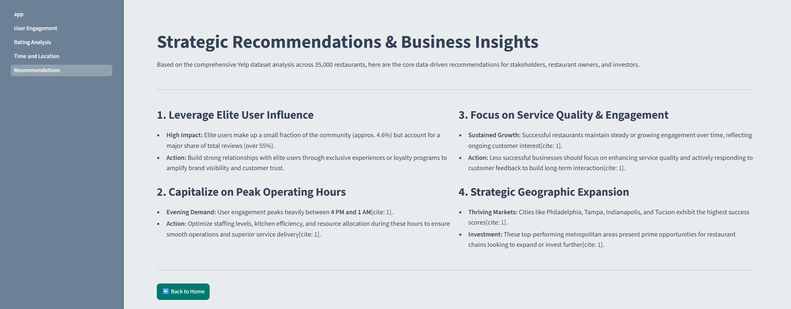

# User Engagement Analysis

## Description

This project is a comprehensive data analysis and visualization tool designed to explore performance metrics, customer engagement trends, rating dynamics, and sentiment analysis across a large-scale Yelp dataset.

The project provides deep insights into customer reviews, peak operating hours, geographical success distribution, and data-driven recommendations for stakeholders, restaurant owners, and investors. 

Built using the **Streamlit** framework, the web app delivers an interactive, clean interface powered by **Python's Pandas, Plotly, and NLTK** for data processing and dynamic visualisations. The underlying data is structured and queried efficiently using an **SQLite** database.

## Accessing the Live Web App

To view the live, hosted version of this project, click the link below:

👉 **[View Live Dashboard](https://user-engagement-analysis.streamlit.app/)** 

In cases where the app is sleeping due to inactivity, simply click the **"Yes, get the app back up"** button and wait a few seconds for the cloud server to relaunch.

## Running Locally from Your System

To run the project on your local machine, execute the following commands in your terminal one by one:

1. **Clone the GitHub repository:**
   ```bash
   git clone [https://github.com/Anushka-dabas/User-Engagement-analysis.git](https://github.com/Anushka-dabas/User-Engagement-analysis.git)

2. **Change current directory to the project folder:**
```bash
cd User-Engagement-analysis

```


3. **Create a virtual environment (optional but recommended):**
```bash
python -m venv venv
source venv/bin/activate  # On Windows use: venv\Scripts\activate

```


4. **Install the required dependencies:**
```bash
pip install -r requirements.txt

```


5. **Run the app using the Streamlit command:**
```bash
streamlit run app.py

```


The app will open automatically in your web browser, allowing you to navigate through the multi-page analytical modules via the sidebar.

## Project Structure & Jupyter Notebooks

The repository includes specialized exploratory notebooks used for data processing and analysis:

* **`notebooks/yelp_data_analysis.ipynb`**: Focuses on advanced analytics, data filtering, correlation analysis, and generating visual trends.
* **`notebooks/yelp_databases.ipynb`**: Manages the database schema setup, processing raw JSON files into structured tables, and executing optimized SQL queries.

## Tech Stack & Core Objectives

* **SQLite:** Core database engine used to query and manipulate large datasets efficiently using optimized SQL scripts.
* **Python (Pandas, Plotly, NLTK):** Used for advanced data manipulation, dynamic visualisations, and sentiment scoring.
* **VADER Sentiment Analysis:** Applied to user reviews to quantify customer sentiment and link feedback with engagement metrics.

* **Key Analytical Goals:** Evaluate how review counts, tips, and check-ins impact ratings, uncover peak operational hours, and map geographic performance trends.

## Dataset

The raw data powering the underlying analysis originates from the official [Yelp Dataset on Kaggle](https://www.kaggle.com/datasets/yelp-dataset/yelp-dataset) consisting of JSON files (businesses, reviews, tips, check-ins, and user profiles).

* **Raw Data:** Due to GitHub's file size limits (100 MB per file), the multi-gigabyte raw files are not stored directly in this repository.
* **App Data:** The web application runs on pre-processed summary and aggregate files, allowing the dashboard to launch instantly without memory constraints.

## App Preview








## Lessons Learned

* **Data Wrangling at Scale:** Gained hands-on experience in cleaning, filtering, grouping, and aggregating large datasets using Pandas and SQL to surface actionable business intelligence.
* **Database Management:** Learned how to process unstructured JSON logs into structured relational tables using SQLite for optimized querying.
* **Interactive UI/UX Design:** Successfully utilized Streamlit's structural components and custom CSS theming to build a clean, distraction-free corporate dashboard aesthetic.

## Known Issues/Bugs

* **Mobile Responsiveness:** The dashboard layout is fully optimized for desktop and tablet screens; mobile device views may require horizontal scrolling for wide data tables.
* **Aggregated View Constraints:** Certain metrics rely on pre-calculated structural groupings to ensure rapid performance across browsing tabs.

## Feedback

For any feedback, suggestions, or project improvements, feel free to open a GitHub Issue or reach out directly via email at anushhkadabas@gmail.com.

```

```
